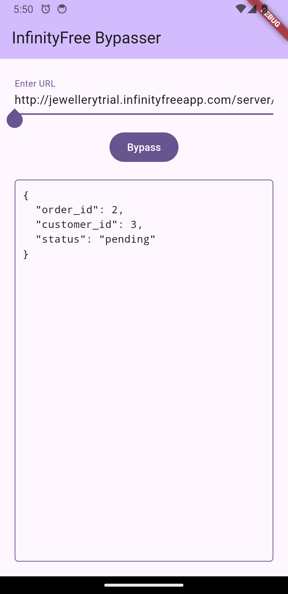

# InfinityFree Bypasser  

**This is a different method!** Unlike traditional approaches that rely on running browser-like requests, this Flutter application bypasses InfinityFree.net's restrictions by calculating the cookie values dynamically and directly adding them to API requests. It eliminates the need for resource-heavy browser emulation, offering a faster and more efficient solution. 

## Features  
- Dynamically calculates cookie values for HTTP requests.  
- Uses Dio for efficient HTTP request handling. 

## Dependencies  
```yaml  
dependencies:  
  dio: ^5.7.0  
  encrypt: ^5.0.3  
```  

## Installation  

1. Clone the repository:  
   ```bash  
   git clone https://github.com/tharushaudana/infinityfree-dio-bypass-flutter.git  
   cd infinityfree-dio-bypass-flutter  
   ```  

2. Install dependencies:  
   ```bash  
   flutter pub get  
   ```  

3. Run the app:  
   ```bash  
   flutter run  
   ```  

## Usage  

### Making a Bypassed Request  
Here’s how the application handles bypassed requests:  

1. The `InfinityfreeBypasser` calculates the required cookie value for the given URL.  
2. The calculated cookie is included in the request headers via Dio.  
3. The response is displayed in the UI, with JSON data being pretty-printed.  

### Example Code  
```dart  
final InfinityfreeBypasser bypasser = InfinityfreeBypasser();  
final Dio dio = Dio();  

Future<void> bypassRequest(String url) async {  
  // Calculate the bypass cookie  
  await bypasser.bypass(url);  

  if (bypasser.cookie != null) {  
    // Make the request with the cookie  
    final response = await dio.get(  
      url,  
      options: Options(  
        headers: {  
          'Cookie': bypasser.cookie,  
        },  
        responseType: ResponseType.plain,  
      ),  
    );  
    print(response.data);  
  } else {  
    print('Bypass failed!');  
  }  
}  
```

## Screenshot


## Common Method for API Requests to Free Servers  
One of the most common methods for sending API requests to free servers like InfinityFree is using **browser-like requests**, where the app runs an actual browser or simulates browser behavior. This involves embedding a webview or using a headless browser to mimic how a real user interacts with the server. However, while this method can bypass some restrictions, it has several drawbacks:

### Why the Browser-like Method is Not Ideal  
1. **Performance Issues:** Running a browser in an app consumes a lot of resources and can significantly slow down performance, especially for mobile devices with limited resources.  
2. **Inefficiency:** Emulating a full browser environment just to send a simple API request is inefficient. It adds unnecessary complexity and overhead to the process.  
3. **Maintenance:** This method requires constant updates as browsers and webview engines change, which can lead to maintenance issues over time.  
4. **Security Risks:** A full browser environment within an app can introduce potential security vulnerabilities, as the app is essentially running a browser within another application.  

The method used in the InfinityFree Bypasser is more efficient. It dynamically calculates the necessary cookie values for requests, avoiding the need for a browser-like environment. This approach is lightweight, faster, and more secure compared to traditional browser-based methods.  

## How Bypass Works  

The process of bypassing InfinityFree.net's API restrictions using the method described in this application involves calculating a special cookie value dynamically. This is done by extracting specific data from the server's response and using that data to decrypt an encrypted value, which is then used as a cookie. Below is a detailed breakdown of how the bypass works:

### Step-by-Step Breakdown:

1. **Initial Request**:  
   The application makes a simple GET request to the target URL (InfinityFree server). This request does not include the cookie, as it's trying to gather information to calculate the correct cookie value.

2. **Extracting JavaScript from the Response**:  
   The server responds with an HTML page, which includes a `<script>` tag containing the JavaScript code responsible for generating the cookie. This script uses AES decryption to calculate the cookie value.  

   Here’s an example of the JavaScript snippet embedded in the response:
   ```html
   <script type="text/javascript" src="/aes.js"></script>
   <script>
     function toNumbers(d){var e=[];d.replace(/(..)/g,function(d){e.push(parseInt(d,16))});return e}
     function toHex(){for(var d=[],d=1==arguments.length&&arguments[0].constructor==Array?arguments[0]:arguments,e="",f=0;f<d.length;f++)e+=(16>d[f]?"0":"")+d[f].toString(16);return e.toLowerCase()}
     var a=toNumbers("f655ba9d09a112d4968c63579db590b4"),
         b=toNumbers("98344c2eee86c3994890592585b49f80"),
         c=toNumbers("063773702db3e21280d5e740ea12dd26");
     document.cookie="__test="+toHex(slowAES.decrypt(c,2,a,b))+"; expires=Thu, 31-Dec-37 23:55:55 GMT; path=/";
     location.href="http://example.infinityfreeapp.com/server/public/api/test/?i=1";
   </script>
   ```

3. **Regex Matching to Extract Variables**:  
   The application uses regular expressions (RegExp) to find specific variables (`a`, `b`, `c`) in the HTML response. These variables are hexadecimal strings required for the decryption process.

   - `a`, `b`, and `c` are the three hex values used to decrypt the final cookie value.
   
4. **Decryption Process**:  
   Once the hex values for `a`, `b`, and `c` are extracted, the application uses the AES algorithm to decrypt the value of `c` using `a` and `b` as the key and initialization vector (IV), respectively. The decryption is performed using the `encrypt` package in Flutter with the CBC (Cipher Block Chaining) mode.

   ```dart
   final key = Key(Uint8List.fromList(a));
   final iv = IV(Uint8List.fromList(b));
   final encrypter = Encrypter(AES(key, mode: AESMode.cbc, padding: null));

   final decrypted = encrypter.decryptBytes(Encrypted(Uint8List.fromList(c)), iv: iv);
   ```

5. **Generating the Cookie**:  
   After the decryption process, the decrypted byte array is converted into a hexadecimal string, which is then used as the value for the `__test` cookie. This cookie is critical for bypassing the restrictions on the API requests. The cookie is then added to the request headers in the subsequent API calls.

   ```dart
   final cookieValue = _toHex(decrypted).toLowerCase();
   cookie = '__test=$cookieValue';
   ```

6. **Making the Bypassed Request**:  
   With the newly generated cookie, the application sends another request to the API, this time including the correct cookie in the headers. This bypasses the server's restrictions, and the server responds with the expected data. 
